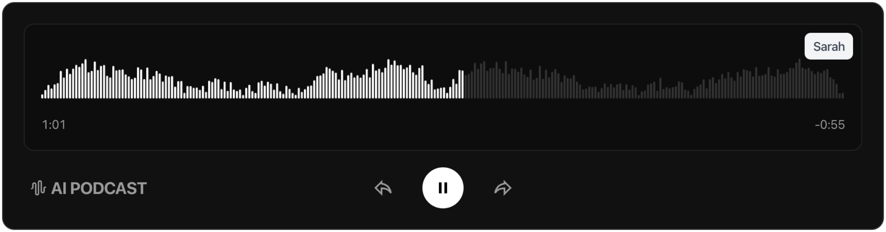

<a href="">
  
  <h1 align="center">AI Pod</h1>  
</a>

<p align="center">
  A Chrome extension that generates podcast-style audio summaries of web pages using the AI SDK.
</p>

</div>

<p align="center">
  <a href="#features"><strong>Features</strong></a> ·
  <a href="#model-provider"><strong>Model provider</strong></a> ·
  <a href="#running-locally"><strong>Running locally</strong></a>
</p>
<br/>

## Features

- [AI SDK](https://ai-sdk.dev/)
  - Advanced AI integration for content analysis and podcast generation
  - Real-time web page content processing and summarization

## Model provider

This extension ships with [OpenAI](https://openai.com/) provider as the default. However, with the [AI SDK](https://sdk.vercel.ai/docs), you can switch LLM providers to [Ollama](https://ollama.com), [Anthropic](https://anthropic.com), [Cohere](https://cohere.com/), and [many more](https://sdk.vercel.ai/providers/ai-sdk-providers) with just a few lines of code.

- Podcast Model (`gpt-4o-mini`): Versatile GPT-4.1 model for content understanding and summarization
- Transcribe Model (`gpt-4o-mini-tts`): Specialized for generating high-quality, natural-sounding speech from text

## Running locally

You will need to use the environment variables to run AI Pod. It's recommended you use `.env` file since its necessary.

> Note: You should not commit your `.env` file or it will expose secrets that will allow others to control access to your AI accounts.

1. **Server Setup**
   ```bash
   cd server
   bun install
   ```

2. **Add environment variables**
   - Create a `.env` file in the `server` directory
   - Add your OpenAI API key: `OPENAI_API_KEY=your_api_key_here`
   ```

3. **Load the extension**
   - Open Chrome and navigate to `chrome://extensions/`
   - Enable "Developer mode" (top right)
   - Click "Load unpacked"
   - Select the `extension` directory

Your server should now be running and the extension will be loaded in Chrome.